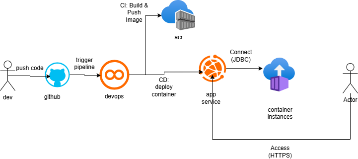

# API Motos Control - Sprint 4 DevOps

API REST para gerenciamento e controle de motocicletas, desenvolvida como parte do Challenge de DevOps Tools & Cloud Computing da FIAP (Sprint 4).

## Descrição da Solução

Esta solução consiste em uma **API REST desenvolvida em Java com Spring Boot** para o controle de motocicletas. A aplicação foi conteinerizada utilizando **Docker** e implantada na nuvem Azure através de um fluxo de CI/CD automatizado.

Os dados são persistidos em um banco de dados **PostgreSQL** rodando em um Azure Container Instance (ACI). Todo o processo de build, testes e deploy é orquestrado pelo **Azure DevOps Pipelines**, garantindo entrega contínua e confiável a cada alteração no código-fonte.

### Stack Tecnológica
* **Linguagem:** Java 17
* **Framework:** Spring Boot
* **Banco de Dados:** PostgreSQL (em container ACI)
* **Containerização:** Docker
* **Nuvem:** Microsoft Azure (Web App for Containers, ACI, ACR)
* **CI/CD:** Azure DevOps Pipelines
* **SCM:** GitHub

## Arquitetura da Solução

O diagrama abaixo ilustra o fluxo de integração e entrega contínua (CI/CD) implementado:



1.  **Push (Code):** O desenvolvedor envia o código para o repositório GitHub.
2.  **Trigger Pipeline:** O Azure DevOps detecta a alteração e inicia a pipeline.
3.  **Build & Push Image (CI):** A pipeline compila o código, roda os testes e envia a imagem Docker para o Azure Container Registry (ACR).
4.  **Deploy (CD):** A pipeline atualiza o Azure Web App com a nova imagem.
5.  **Pull Image:** O Web App baixa a imagem atualizada do ACR.
6.  **Connect DB:** A aplicação conecta-se ao banco PostgreSQL rodando no ACI.
7.  **Acesso:** O usuário final acessa a API via HTTPS.

## Detalhamento dos Componentes

| Componente | Tipo | Descrição Funcional | Tecnologia/Ferramenta |
| :--- | :--- | :--- | :--- |
| **API Motos** | Aplicação | API REST para gerenciamento de motos. | Java 17, Spring Boot |
| **Repositório** | SCM | Armazena e versiona o código-fonte. | GitHub |
| **Pipeline CI/CD** | Orquestrador | Automatiza build, testes e deploy. | Azure DevOps Pipelines |
| **Container Registry** | Registro | Armazena as imagens Docker da aplicação. | Azure Container Registry (ACR) |
| **Web App** | PaaS (Compute) | Hospeda e executa a aplicação conteinerizada. | Azure Web App for Containers |
| **Banco de Dados** | Container (IaaS) | Armazena os dados da aplicação de forma persistente. | PostgreSQL em Azure Container Instance (ACI) |

## Como Executar o Projeto (Infraestrutura)

Para replicar este ambiente na Azure, você pode utilizar o script de provisionamento incluído neste repositório.

### Pré-requisitos
* [Azure CLI](https://learn.microsoft.com/cli/azure/install-azure-cli) instalado e logado (`az login`).

### Passo a Passo

1.  Execute o script de criação da infraestrutura:
    ```bash
    ./deploy_infrastructure.sh
    ```
    *Este script criará o Grupo de Recursos, ACR, ACI (PostgreSQL) e o Plano de App Service.*

2.  Após a execução, anote o **IP público** do banco de dados exibido no final do script.

3.  No **Azure DevOps**, configure um Grupo de Variáveis (`Library`) com as seguintes chaves:
    * `SPRING_DATASOURCE_URL`: `jdbc:postgresql://<IP_DO_BANCO>:5432/motosdb`
    * `SPRING_DATASOURCE_USERNAME`: (Usuário definido no script)
    * `SPRING_DATASOURCE_PASSWORD`: (Senha definida no script - **Use o cadeado para proteger!**)

4.  Crie a pipeline utilizando o arquivo `azure-pipelines.yml` presente na raiz deste repositório.

## Autores

* **Pedro Henrique de Souza** - RM555533 - 2TDSPx
* **Felipe Rosa Peres** - RM557636 - 2TDSPx
* **Vinicius de Souza Sant Anna** - RM556841 - 2TDSPx